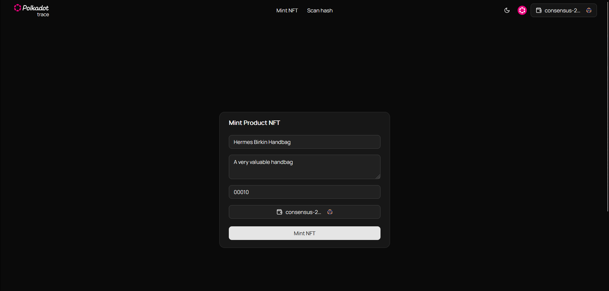
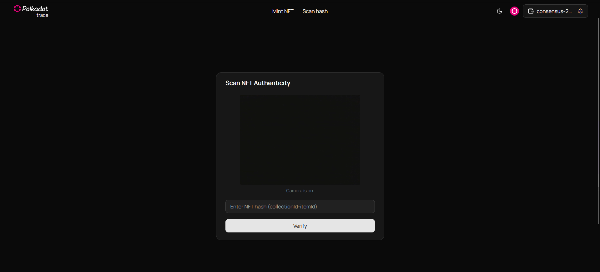

# 🧾 Trace — NFT-Based Product Authentication on Polkadot

Offers a product authentication platform to help luxury brands fight counterfeits using NFTs uniquely linked to each physical item via Polkadot.

---

## 🎥 Demo Video

📺 [video in progress](https://example.com/demo-video)

---

## 🖼️ Screenshots

- 
- 

---

## 🔗 How It Works (Blockchain Interaction)

1. **NFT Minting**: Each product is minted as a unique NFT on the Polkadot Asset Hub using `Transactions.Nfts.create`.
2. **Physical Link**: The NFT hash is laser-etched, QR-coded, or NFC-tagged onto the physical product.
3. **Ownership Tracking**: Ownership is tied to wallet addresses; all transfers are on-chain.
4. **Verification**: Anyone can scan the tag to validate authenticity and view ownership history.
5. **Theft Deterrence**: Resold or stolen items can be flagged and traced due to transparent transfer logs.

> Smart contracts use the `westend_asset_hub` descriptor and Polkadot-js browser extension for signing.

---

## 🗂️ Repo Structure

trace/
├── contracts/ # Smart contracts (if applicable)
├── frontend/ # Next.js web app
│ ├── components/ # UI components (Card, Button, WalletSelect)
│ ├── pages/ # Mint + Verify product pages
│ └── providers/ # Polkadot extension integration
├── public/screenshots/ # App UI screenshots
├── README.md
└── ...
